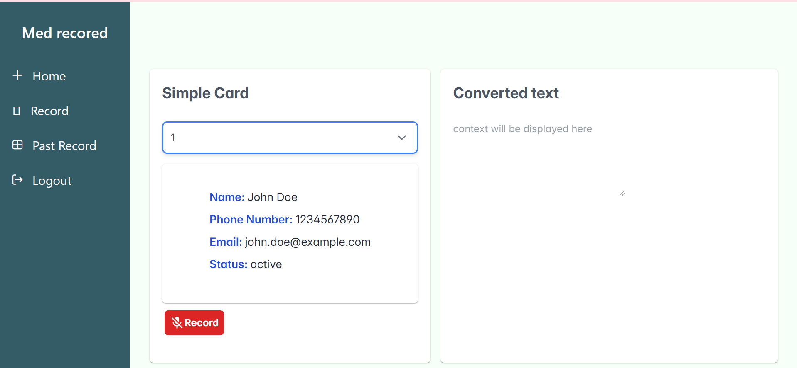

# Patient Information Dashboard

A responsive and user-friendly React application for managing patient information. This frontend provides an intuitive interface for selecting and viewing patient details, including name, contact information, and status. The app is built with React and styled using Tailwind CSS and PrimeReact components, making it clean, responsive, and accessible. 



## 📋 Features
- **Patient Selection**: Dropdown menu to select patients by ID and fetch details dynamically.
- **Patient Details**: Displays patient name, phone number, email, and status.
- **Voice Recording Toggle**: Simple UI to start and stop voice recording with clear visual indicators.
- **Converted Text Display**: A read-only text area for displaying processed or transcribed text.
  
## 🛠️ Technologies Used
- **React**: Core library for building the interface.
- **PrimeReact**: Component library used for UI elements like `Card`, `Dropdown`, `Button`, and `InputTextarea`.
- **Tailwind CSS**: Utility-first CSS framework for custom styling and layout.
- **Material UI (MUI)**: Icon components for the recording toggle.
- **Axios**: For making API requests to fetch patient data.

## 🚀 Getting Started

### Prerequisites
- **Node.js** and **npm** installed on your machine.

### Installation

1. Clone the repository:
   ```bash
   git clone https://github.com/PragaL15/med_admin

### Built

Running command -- `npm run dev`
