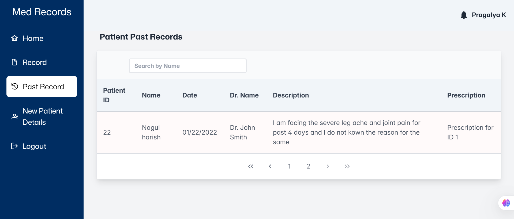
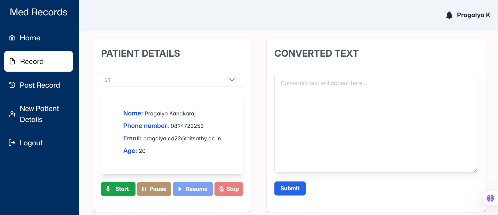

# 🏥 Patient Information Dashboard  

A **responsive** and **user-friendly** React application for managing patient information. This frontend provides an intuitive interface for selecting and viewing patient details, including **name, contact information, and status**.  

The app is built with **React**, styled using **Tailwind CSS** and **PrimeReact** components, ensuring a **clean, responsive, and accessible** UI.  

---

## 📸 **Screenshots**
### 🏥 **Patient Past Records**


### 📊 **Doctor-Patient recording**


---

## 📋 **Features**
✅ **Patient Selection** - Dropdown menu to select patients by ID and fetch details dynamically.  
✅ **Patient Details** - Displays patient name, phone number, email, and status.  
✅ **Voice Recording Toggle** - Simple UI to start and stop voice recording with clear visual indicators.  
✅ **Converted Text Display** - A read-only text area for displaying processed or transcribed text.  

---

## 🛠️ **Technologies Used**
- 🚀 **React** - Core library for building the interface.  
- ⚡ **PrimeReact** - UI components (`Card`, `Dropdown`, `Button`, `InputTextarea`).  
- 🎨 **Tailwind CSS** - Utility-first CSS framework for styling.  
- 🖼️ **Material UI (MUI)** - Icon components for the recording toggle.  
- 🔗 **Axios** - For making API requests to fetch patient data.  

---

## 🚀 **Getting Started**
### **🔹 Prerequisites**
Ensure you have **Node.js** and **npm** installed.  

### **🔹 Installation Steps**
1️⃣ Clone the repository:  
```bash
git clone https://github.com/PragaL15/med_admin.git
cd med_admin
```
2️⃣ Install dependencies:  
```bash
npm install
```
3️⃣ Start the development server:  
```bash
npm run dev
```
Now, the application should be running at **`http://localhost:5173/`** 🚀  

---

## 📌 **Folder Structure**
```sh
med_admin/
│── public/        
│── src/          
│── package.json  
│── tailwind.config.js # Tailwind CSS configuration
│── vite.config.js  # Vite project configuration
```
---

## 🔥 **Upcoming Features**
✅ **Dark Mode Support** 🌙  
✅ **Real-time Data Sync** 🔄  
✅ **Multi-Language Support** 🌍  

---

## 👨‍💻 **Contributors**
💡 **Pragalya Kanakaraj** - Frontend Developer 🚀  

---

## 📝 **License**
📜 MIT License - Use it freely, modify it responsibly!  

---
